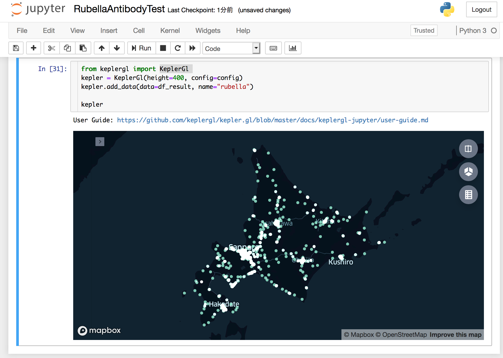

# 風しん抗体検査・風しん第５期定期接種 受託医療機関 可視化

厚生労働省が公開している [風しん抗体検査・風しん第５期定期接種受託医療機関](https://www.mhlw.go.jp/stf/seisakunitsuite/bunya/kenkou_iryou/kenkou/kekkaku-kansenshou/rubella/index_00001.html) のデータを可視化した．

下記の一連の処理を全て Pythonを使い jupyter notebookの中で実行するサンプルになっています．

- PDFから tabulaを使って CSVデータを取り出す
- 東京大学空間情報科学研究センターのアドレスマッチング・サービスを使って 住所から経緯度を割り出す
- kepler.glを使って地図上に位置情報をプロットする

### 注意事項

地図上で表示される位置は精度が低いため，実際の位置とはズレがあります
